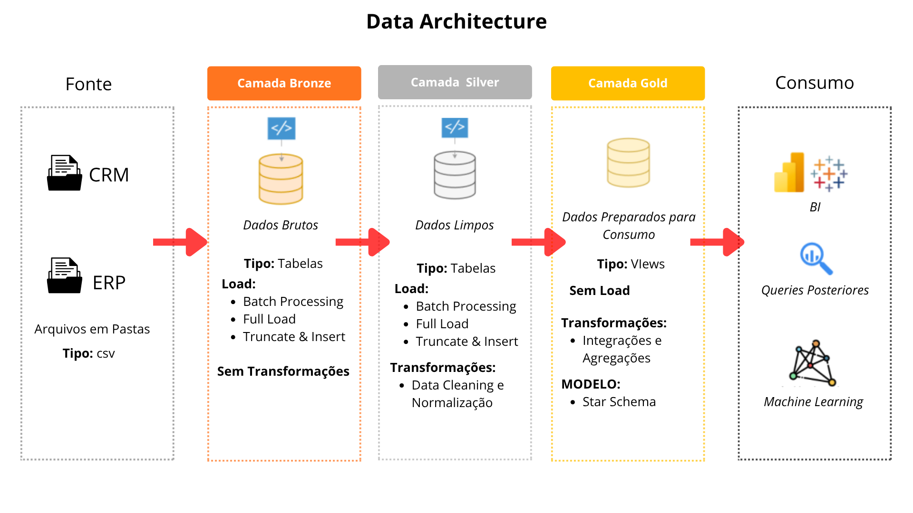

# Projeto de Data Warehouse e Analytics

Bem-vindo(a) ao repositório do **Projeto de Data Warehouse e Analytics**! 🚀
Este projeto demonstra uma solução completa de data warehousing e analytics, desde a construção de um data warehouse até a geração de insights acionáveis. Pensado como um projeto de portfólio, ele destaca boas práticas de mercado em engenharia de dados e analytics.

---
## 🏗️ Arquitetura de Dados

A arquitetura de dados deste projeto segue a Arquitetura Medalhão, com as camadas **Bronze**, **Silver** e **Gold**:


1. **Camada Bronze**: Armazena os dados brutos exatamente como vêm dos sistemas de origem. Os dados são carregados a partir de arquivos CSV para um banco de dados **PostgreSQL**.
2. **Camada Silver**: Esta camada inclui processos de limpeza, padronização e normalização dos dados para prepará-los para análise.
3. **Camada Gold**: Contém os dados prontos para o negócio, modelados em esquema estrela (`gold.dim_customer`, `gold.dim_product`, `gold.fact_sales`) necessários para relatórios e análises.

---
## 📖 Visão Geral do Projeto

Este projeto envolve:

1. **Arquitetura de Dados**: Desenho de um data warehouse moderno usando a Arquitetura Medalhão com as camadas **Bronze**, **Silver** e **Gold**.
2. **Pipelines de ETL**: Extração, transformação e carga de dados dos sistemas de origem para o data warehouse, usando stored procedures em PostgreSQL (`plpgsql`).
3. **Modelagem de Dados**: Desenvolvimento de views de fato e dimensão otimizadas para consultas analíticas.
4. **Analytics e Relatórios**: Criação de relatórios e dashboards baseados em SQL para gerar insights acionáveis.


---


## 🚀 Requisitos do Projeto

### Construção do Data Warehouse

#### Objetivo
Desenvolver um data warehouse moderno usando PostgreSQL para consolidar os dados de vendas, possibilitando relatórios analíticos e tomada de decisão informada.

#### Especificações
- **Fontes de Dados**: Importar dados de dois sistemas de origem (ERP e CRM), fornecidos como arquivos CSV.
- **Qualidade de Dados**: Limpar e resolver problemas de qualidade de dados antes da análise.
- **Integração**: Combinar as duas fontes em um único modelo de dados amigável, projetado para consultas analíticas.
- **Escopo**: Focar apenas no conjunto de dados mais recente; não é necessário historizar os dados.
- **Documentação**: Fornecer documentação clara do modelo de dados para dar suporte tanto às áreas de negócio quanto às equipes de analytics.

---

### BI: Analytics e Relatórios (Análise de Dados)

#### Objetivo
Desenvolver análises baseadas em SQL para entregar insights detalhados sobre:
- **Comportamento do Cliente**
- **Performance de Produtos**
- **Tendências de Vendas**

Esses insights capacitam as áreas de negócio com métricas-chave, permitindo decisões estratégicas.

## 📂 Estrutura do Repositório
```
data-warehouse-project/
│
├── datasets/                           # Datasets brutos usados no projeto (dados de ERP e CRM)
│
├── docs/                               # Documentação do projeto e detalhes da arquitetura
│   ├── data_architecture.png           # Arquivo mostrando a arquitetura do projeto
│   ├── data_catalog.md                 # Catálogo dos datasets, com descrição dos campos e metadados
│   ├── data_flow.png                   # Arquivodo diagrama de fluxo de dados
│   ├── naming-conventions.md           # Diretrizes de nomenclatura para tabelas, colunas e arquivos
│
├── scripts/                            # Scripts SQL (PostgreSQL / plpgsql) para ETL e transformações
│   ├── bronze/                         # Scripts para extração e carga dos dados brutos (ddl_bronze, load_bronze)
│   ├── silver/                         # Scripts para limpeza e transformação dos dados (ddl_silver, load_silver)
│   ├── gold/                           # Scripts para criação das views analíticas (gold_views)
│
├── tests/                              # Scripts de verificação de qualidade dos dados (quality_checks_silver, quality_checks_gold)
│
├── README.md                           # Visão geral do projeto e instruções
├── LICENSE                             # Informações de licença do repositório
├── .gitignore                          # Arquivos e pastas ignorados pelo Git
```
